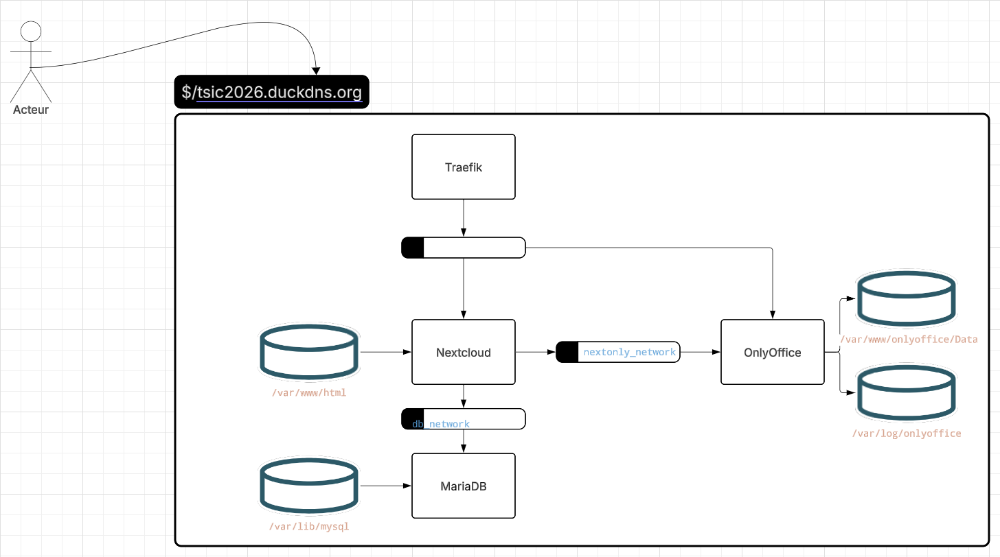

# geodatadrive

Pour l'accès aux serveurs ; https://drive.ird.fr/s/tsic2026 dans le fichier instructions.md

Faire les étapes d'installation de la clef ssh et de configuration.
Faire `ssh node01` pour tester l'installation. Si une passphrase est demandée, rentrez `docker`.


# Monitoring 

### Docker file

Fichier à modifier : docker-compose.yaml 
Potentiellement prometheus.yaml à modifier pour paramétrer grafana

### Déployement 

prometheus node01 :

```bash
docker stack deploy <name>
```

### Liens utiles 
```bash
https://grafana.com/docs/grafana/latest/fundamentals/getting-started/first-dashboards/get-started-grafana-prometheus/

https://hub.docker.com/r/grafana/grafana
```


```bash
https://docs.docker.com/reference/cli/docker/stack/deploy/

```


```bash
https://prometheus.io/docs/prometheus/latest/configuration/configuration/#dns_sd_config

https://prometheus.io/docs/guides/node-exporter/

https://prometheus.io/docs/prometheus/latest/getting_started/

```

## grafana :
id : admin
mdp : admin

Une fois sur grafana on doit ajouter la connection prometheus.

* l'id du module pour le dashboard Prometheus sur grafana 1860
[lien](https://grafana.com/grafana/dashboards/1860-node-exporter-full/)

On cree le dashboard avec prometheus.


## NextCloud
* 11033


à noter, il faut generer le token d'abord avant de l'ancer l'exporteur

à executer au sein du container de nextcloud, avec la commande :
``` bash
 docker container exec -u www-data -it IDCONTAINER bash 
# Generate random value (for example using openssl)
TOKEN=$(openssl rand -hex 32)
# Set token (using the occ console application)
occ config:app:set serverinfo token --value "$TOKEN"
``` 



### Configuration Trusted_Domains pour nextcloud

On a mis  le nexcloud dans le fichier config/config.php de nextcloud


### mariadb
 L'id du dashboard de mariadb 14621
    - MYSQL_ROOT_PASSWORD=root
    - MYSQL_PASSWORD=user
    - MYSQL_DATABASE=nextcloud
    - MYSQL_USER=nextcloud


### cAdvisor depends on redis